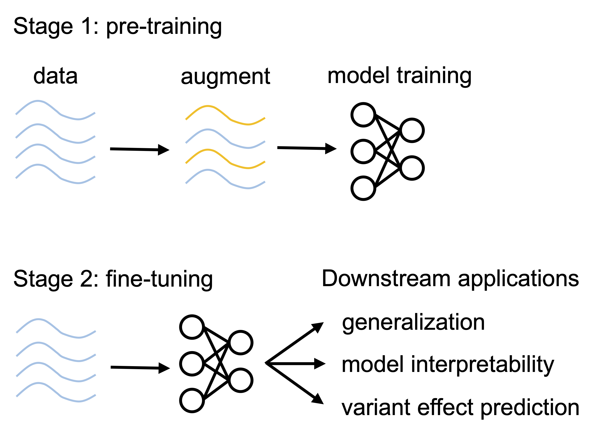

# EvoAug

EvoAug is a PyTorch package to pretrain sequence-based deep learning models for regulatory genomics data with evolution-inspired data augmentations followed by a finetuning on the original, unperturbed sequence data. This work uses PyTorch Lightning -- LightningModule -- to define a model wrapper that is used for training. This is work that directly follows from "Evolution-inspired augmentations improve deep learning for regulatory genomics" by Nicholas Keone Lee, Ziqi (Amber) Tang, Shushan Toneyan, and Peter K Koo.

For questions, email: koo@cshl.edu





#### Install:

```
pip install evoaug
```


#### Dependencies:

```
torch 1.12.1+cu113
pytorch_lightning 1.7.7
numpy 1.21.6
```


#### Example

```python
from evoaug import evoaug, augment
import pytorch_lightning as pl

model = "DEFINE PYTORCH MODEL"
loss = "DEFINE PYTORCH LOSS"
optimizer_dict = "DEFINE OPTIMIZER OR OPTIMIZER DICT"

augment_list = [
	augment.RandomDeletion(delete_min=0, delete_max=20),
	augment.RandomRC(rc_prob=0.5),
	augment.RandomInsertion(insert_min=0, insert_max=20),
	augment.RandomTranslocation(shift_min=0, shift_max=20),
	augment.RandomMutation(mut_frac=0.05),
	augment.RandomNoise(noise_mean=0, noise_std=0.2),
]

robust_model = evoaug.RobustModel(
	model,
	criterion=loss,
	optimizer=optimizer_dict,
	augment_list=augment_list,
	max_augs_per_seq=2,  # maximum number of augmentations per sequence
	hard_aug=True,  # use max_augs_per_seq, otherwise sample randomly up to max
	inference_aug=False  # if true, keep augmentations on during inference time
)

# set up callback
callback_topmodel = pl.callbacks.ModelCheckpoint(
	monitor='val_loss',
	save_top_k=1,
	dirpath=output_dir,
	filename=ckpt_aug_path
)

# train model
trainer = pl.Trainer(
	gpus=1,
	max_epochs=100,
	auto_select_gpus=True,
	logger=None,
	callbacks=["ADD CALLBACKS", callback_topmodel]
)

# pre-train model with augmentations
trainer.fit(robust_model, datamodule=data_module)

# load best model
robust_model = evoaug.load_model_from_checkpoint(robust_model, ckpt_aug_path)

# set up fine-tuning
robust_model.finetune = True
robust_model.optimizer = # set up optimizer for fine-tuning

# set up callback
callback_topmodel = pl.callbacks.ModelCheckpoint(
	monitor='val_loss',
	save_top_k=1,
	dirpath=output_dir,
	filename=ckpt_finetune_path
)

# set up pytorch lightning trainer
trainer = pl.Trainer(
	accelerator="gpu",
	device=1,
	max_epochs=100,
	auto_select_gpus=True,
	logger=None,
	callbacks=["ADD CALLBACKS", callback_topmodel]
)

# fine-tune model
trainer.fit(robust_model, datamodule=data_module)

# load best fine-tuned model
robust_model = evoaug.load_model_from_checkpoint(robust_model, ckpt_finetune_path)
```


#### Examples on Google Colab:

DeepSTARR analysis:
```
https://colab.research.google.com/drive/1a2fiRPBd1xvoJf0WNiMUgTYiLTs1XETf?usp=sharing
```

ChIP-seq analysis:
```
https://colab.research.google.com/drive/1GZ8v4Tq3LQMZI30qvdhF7ZW6Kf5GDyKX?usp=sharing
```

